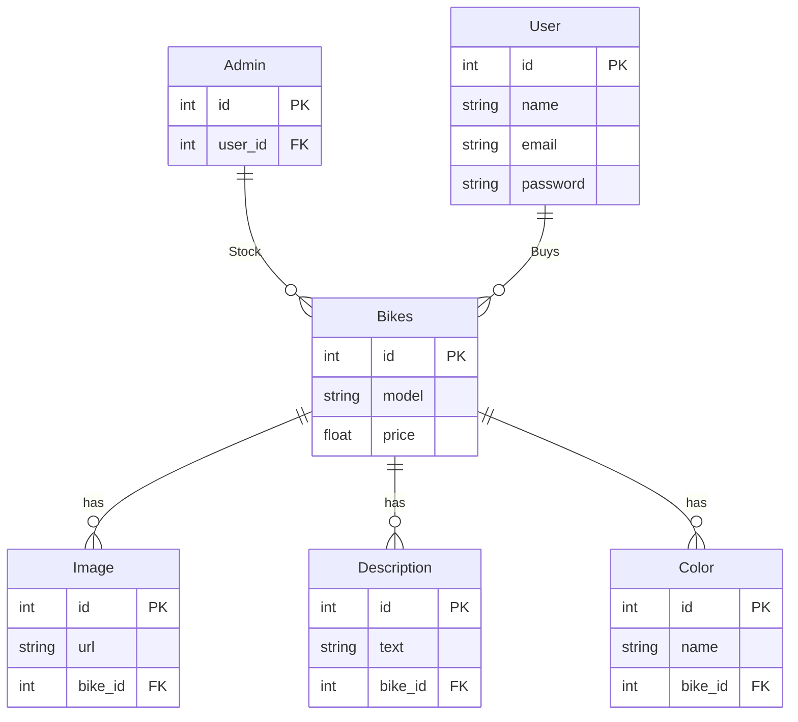

# Progetto-info

## Analisi

### Tabelle

1. User  
2. Admin  
3. Bikes  
4. Color  
5. Image  
6. Description  

### Relazioni presenti

In questo progetto ci sono 6 entità che hanno le seguenti relazioni:  
- **User** ha una relazione 1-N con **Bikes** perché un utente può acquistare più moto, ma una moto non può essere acquistata da più utenti.  
- **Bikes** ha relazioni 1-N con **Color**, **Image** e **Description** perché una moto può avere più colori, immagini e descrizioni, ma due moto non condivideranno mai le stesse immagini, descrizioni o colori.  

### ER



### Schema logico

- **User**(id, name, email, password)  
- **Admin**(id, user_id[FK])  
- **Bikes**(id, model, price, user_id[FK])  
- **Color**(id, name, bike_id[FK])  
- **Image**(id, url, bike_id[FK])  
- **Description**(id, text, bike_id[FK])  

## SQL

### Codice SQL

```sql
-- Creazione della tabella User
CREATE TABLE User (
    id INT PRIMARY KEY,
    name VARCHAR(255) NOT NULL,
    email VARCHAR(255) NOT NULL UNIQUE,
    password VARCHAR(255) NOT NULL
);

-- Creazione della tabella Admin
CREATE TABLE Admin (
    id INT PRIMARY KEY,
    user_id INT NOT NULL,
    FOREIGN KEY (user_id) REFERENCES User(id)
);

-- Creazione della tabella Bikes
CREATE TABLE Bikes (
    id INT PRIMARY KEY,
    model VARCHAR(255) NOT NULL,
    price FLOAT NOT NULL,
    user_id INT NOT NULL,
    FOREIGN KEY (user_id) REFERENCES User(id)
);

-- Creazione della tabella Color
CREATE TABLE Color (
    id INT PRIMARY KEY,
    name VARCHAR(255) NOT NULL,
    bike_id INT NOT NULL,
    FOREIGN KEY (bike_id) REFERENCES Bikes(id)
);

-- Creazione della tabella Image
CREATE TABLE Image (
    id INT PRIMARY KEY,
    url VARCHAR(255) NOT NULL,
    bike_id INT NOT NULL,
    FOREIGN KEY (bike_id) REFERENCES Bikes(id)
);

-- Creazione della tabella Description
CREATE TABLE Description (
    id INT PRIMARY KEY,
    text TEXT NOT NULL,
    bike_id INT NOT NULL,
    FOREIGN KEY (bike_id) REFERENCES Bikes(id)
);
```

### Integrazioni

```sql
-- Inserimento dati nella tabella User
INSERT INTO User (id, name, email, password) VALUES
(1, 'Mario Rossi', 'mario.rossi@example.com', 'password123'),
(2, 'Luigi Bianchi', 'luigi.bianchi@example.com', 'securepass456');

-- Inserimento dati nella tabella Admin
INSERT INTO Admin (id, user_id) VALUES
(1, 1);

-- Inserimento dati nella tabella Bikes
INSERT INTO Bikes (id, model, price, user_id) VALUES
(1, 'S 1000 RR', 21450.00, 1),
(2, 'Yamaha R1', 20699.00, 2);

-- Inserimento dati nella tabella Color
INSERT INTO Color (id, name, bike_id) VALUES
(1, 'Metallic Gray/Black', 1),
(2, 'Midnight Black', 2);

-- Inserimento dati nella tabella Image
INSERT INTO Image (id, url, bike_id) VALUES
(1, 'static/favicon/bikes/liter_bikes/s1000rr_2.png', 1),
(2, 'static/favicon/bikes/liter_bikes/r1_2.jpg', 2);

-- Inserimento dati nella tabella Description
INSERT INTO Description (id, text, bike_id) VALUES
(1, 'A powerful and stylish motorcycle.', 1),
(2, 'A high-performance racing bike.', 2);
```

## Progettazione della pagina WEB

Python con Flask per il backend
SQLite per il database
HTML e Bootstrap per il frontend
Form submissions per le interazioni utente

### Struttura del progetto

```
Dealership/
├── app.py             
├── project-dealership.session.sql        
├── progress.md 
├── README.md         
├── static/           
│   ├── styles/
│   │        ├── login.css
│   │        ├── main.css
│   │        ├── account.css
│   │        ├── model.css
│   │        └── reg.css
│   ├── scripts/
│   │        ├── login.js
│   │        ├── main.js
│   │        ├── model.js
│   │        └── script.js
│   └── images/
│       ├── A2/
│       ├── display/
│       ├── liter_bikes/
│       ├── super_sport/
│       └── naked/
└── templates/       
  ├── account.html
  ├── log_page.html
  ├── main.html
  ├── model.html
  ├── reg_page.html
  └── request_quote.html
```

## Codice

