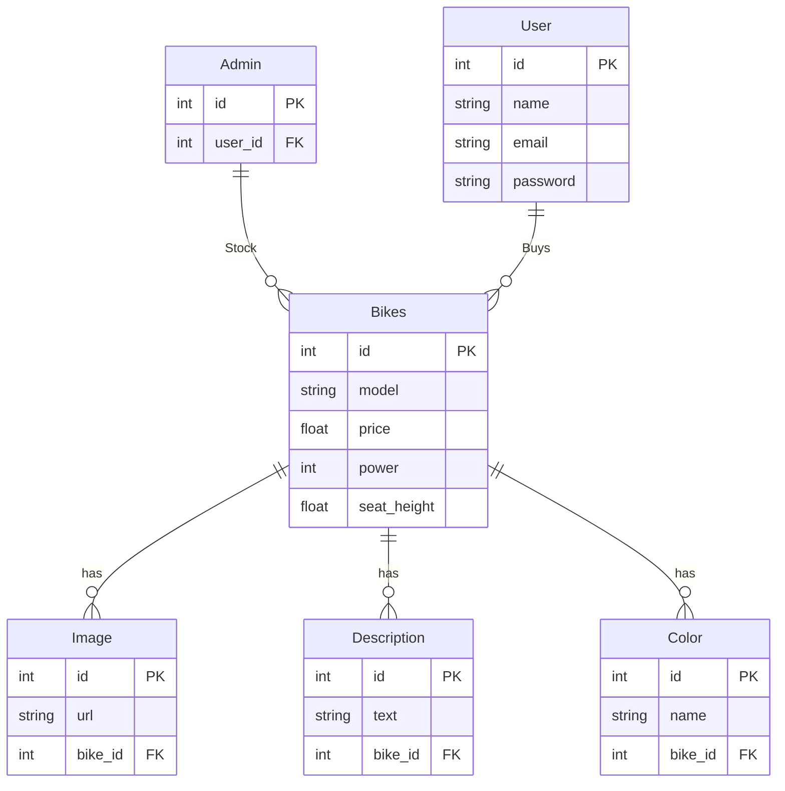

# Progetto-info

### Analisi

In questo progetto si presenta una Dealership di Moto incentrata sulla visione di moto e la richiesta di preventivi su di essa. Si individuano delle entita' principali che spiccano, che sono: Moto e User. La Moto e' stata scelta ovviamente perche' essendo una caratteristica principale del progetto va inculsa, lo User invece perche' c'e' una persona dietro alla richieste di preventivi, a cui serve fare un log in. Ci sono anche altre entita' che sono: Admin, Color, Image e Description. Queste sono sotto categorie delle due principali.

### Tabelle

1. User  
2. Admin  
3. Bikes  
4. Color  
5. Image  
6. Description  

### Relazioni presenti

In questo progetto ci sono 6 entità che hanno le seguenti relazioni:  
- **User** ha una relazione 1-N con **Bikes** perché un utente può acquistare più moto, ma una moto non può essere acquistata da più utenti.  
- **Bikes** ha relazioni 1-N con **Color**, **Image** e **Description** perché una moto può avere più colori, immagini e descrizioni, ma due moto non condivideranno mai le stesse immagini, descrizioni o colori.  

### ER



### Commento

La scelta di User e Bikes come entità principali è strategica dato che rappresentano rispettivamente gli acquirenti e i prodotti centrali del business, essendo un progetto focalizzato su questo. Questa distinzione permette una chiara separazione tra dati degli utenti e caratteristiche delle moto. L'Admin è rappresentato come un'entità separata che estende User invece di essere integrato nella stessa tabella. Questo permette una gestione dei permessi più flessibile e mantiene una chiara separazione tra ruoli. Le entità Image, Description e Color sono collegate alla tabella Bikes con relazioni 1-N. Questa scelta consente di:

- Associare multiple immagini a ciascuna moto

- Gestire diverse descrizioni 

- Offrire varianti di colore per lo stesso modello

La separazione delle caratteristiche in entità distinte rispetta i principi di normalizzazione del database, evitando la duplicazione dei dati e facilitando l'aggiornamento delle informazioni specifiche. Questa struttura supporta efficacemente sia le funzionalità di visualizzazione del catalogo che quelle di gestione degli acquisti e dei preventivi, fornendo un'architettura scalabile per future espansioni del sistema.


### Schema logico

- **User**(id, name, email, password)  
- **Admin**(id, user_id[FK])  
- **Bikes**(id, model, price, power, seat_height, user_id[FK])  
- **Color**(id, name, bike_id[FK])  
- **Image**(id, url, bike_id[FK])  
- **Description**(id, text, bike_id[FK])  

## SQL

### Codice SQL

```sql
-- Creazione della tabella User
CREATE TABLE User (
    id INT PRIMARY KEY,
    name VARCHAR(255) NOT NULL,
    email VARCHAR(255) NOT NULL UNIQUE,
    password VARCHAR(255) NOT NULL
);

-- Creazione della tabella Admin
CREATE TABLE Admin (
    id INT PRIMARY KEY,
    user_id INT NOT NULL,
    FOREIGN KEY (user_id) REFERENCES User(id)
);

-- Creazione della tabella Bikes
CREATE TABLE Bikes (
    id INT PRIMARY KEY,
    model VARCHAR(255) NOT NULL,
    price FLOAT NOT NULL,
    year INT NOT NULL,
    power FLOAT NOT NULL,
    seat_height FLOAT NOT NULL,
    user_id INT NOT NULL,
    FOREIGN KEY (user_id) REFERENCES User(id)
);

-- Creazione della tabella Color
CREATE TABLE Color (
    id INT PRIMARY KEY,
    name VARCHAR(255) NOT NULL,
    bike_id INT NOT NULL,
    FOREIGN KEY (bike_id) REFERENCES Bikes(id)
);

-- Creazione della tabella Image
CREATE TABLE Image (
    id INT PRIMARY KEY,
    url VARCHAR(255) NOT NULL,
    bike_id INT NOT NULL,
    FOREIGN KEY (bike_id) REFERENCES Bikes(id)
);

-- Creazione della tabella Description
CREATE TABLE Description (
    id INT PRIMARY KEY,
    text TEXT NOT NULL,
    bike_id INT NOT NULL,
    FOREIGN KEY (bike_id) REFERENCES Bikes(id)
);
```

### Integrazioni SQL

```sql
-- Inserimento dati nella tabella User
INSERT INTO User (id, name, email, password) VALUES
(1, 'Mario Rossi', 'mario.rossi@example.com', 'password123'),
(2, 'Luigi Bianchi', 'luigi.bianchi@example.com', 'securepass456');

-- Inserimento dati nella tabella Admin
INSERT INTO Admin (id, user_id) VALUES
(1, 1);

-- Insert default admin user
INSERT OR IGNORE INTO users (id, email, password) VALUES
    (1, 'admin@motodealer.com', 'admin123');

INSERT OR IGNORE INTO admin (id, user_id) VALUES
    (1, 1);

-- Inserimento delle moto - Sport/Liter Bikes
INSERT INTO Bikes (id, model, price, year, power, seat_height, user_id) VALUES
    (1, 'S 1000 RR', 21450.00, 2025, 210, 832, 1),
    (2, 'R1', 20699.00, 2025, 200, 855, 2),
    (3, 'ZX-10R', 29990.00, 2025, 203, 835, 1),
    (4, 'Panigale V4', 27790.00, 2025, 215, 830, 2),
    (5, 'GSX-R1000', 17990.00, 2025, 199, 825, 1),
    (6, 'CBR1000RR-R', 31490.00, 2025, 217, 831, 2),
    (7, 'RSV4', 20999.00, 2025, 220, 840, 1),

-- Inserimento dei colori
-- S 1000 RR colors
INSERT INTO Color (id, name, swatch, image, bike_id) VALUES
    (1, 'Black Storm Metallic', '#000000', 'static/favicon/bikes/liter_bikes/s1k_color_2.webp', 1),
    (2, 'Light White/M Motorsport', '{"color1":"#ffffff","color2":"#003578"}', 'static/favicon/bikes/liter_bikes/s1k_color.webp', 1),
    (3, 'Metallic Gray/Black', '{"color1":"#808080","color2":"#000000"}', 'static/favicon/bikes/liter_bikes/s1k_color_3.webp', 1);


-- Inserimento delle immagini principali per ogni moto
-- Sport/Liter Bikes
INSERT INTO Image (id, url, bike_id) VALUES
    (1, 'static/favicon/bikes/liter_bikes/s1000rr_2.png', 1),
    (2, 'static/favicon/bikes/liter_bikes/s1000rr_3.png', 1),
    (3, 'static/favicon/bikes/liter_bikes/s1000rr_4.mp4', 1),
    (4, 'static/favicon/bikes/liter_bikes/r1_2.jpg', 2),
    (5, 'static/favicon/bikes/liter_bikes/r1_4.png', 2),
    (6, 'static/favicon/bikes/liter_bikes/r1_3.jpg', 2),
    (7, 'static/favicon/bikes/liter_bikes/zx10r_2.png', 3),
    (8, 'static/favicon/bikes/liter_bikes/zx10r_3.png', 3),
    (9, 'static/favicon/bikes/liter_bikes/v4.mp4', 4),
    (10, 'static/favicon/bikes/liter_bikes/v4_3.webp', 4),
    (11, 'static/favicon/bikes/liter_bikes/v4_4.jpg', 4),
    (12, 'static/favicon/bikes/liter_bikes/GSX-R1000.jpg', 5),
    (13, 'static/favicon/bikes/liter_bikes/GSX-R1000_3.png', 5),
    (14, 'static/favicon/bikes/liter_bikes/fire.webp', 6),
    (15, 'static/favicon/bikes/liter_bikes/cb_7.PNG', 6),
    (16, 'static/favicon/bikes/liter_bikes/cb_1.jpg', 6),
    (17, 'static/favicon/bikes/liter_bikes/cb_2.jpg', 6),
    (18, 'static/favicon/bikes/liter_bikes/cb_3.jpg', 6),
    (19, 'static/favicon/bikes/liter_bikes/cb_4.jpg', 6),
    (20, 'static/favicon/bikes/liter_bikes/cb_5.jpg', 6),
    (21, 'static/favicon/bikes/liter_bikes/cb_6.jpg', 6),
    (22, 'static/favicon/bikes/liter_bikes/rsv4_2.avif', 7),
    (23, 'static/favicon/bikes/liter_bikes/rsv4_3.avif', 7);

```

## Progettazione della pagina WEB

I linguaggi che ho voluto usare sono:
- Python con Flask per il backend
- SQLite per il database
- HTML e Bootstrap per il frontend
- JS per la gestione dinamica dell'interfaccia utente

### Struttura del progetto

Questa e' la struttura file del progetto:
```
Progetto-info-3/
├── database.db
├── email_config.json
├── email_config.json.example
├── progetto.md
├── progress.md
├── project-dealership-session.sql
├── project-session.sql
├── project-dealership-session.sql
├── README.md
├── requirements.txt
├── server.py
├── setup.sh
├── venv/
│   ├── bin/
│   ├── include/
│   └── lib/
├── static/
│   ├── styles/
│   │   ├── login.css
│   │   ├── main.css
│   │   ├── model.css
│   │   ├── quote.css
│   │   └── reg.css
│   ├── scripts/
│   │   ├── filter.js
│   │   ├── loading-state.js
│   │   ├── login.js
│   │   ├── main.js
│   │   ├── models.js
│   │   └── script.js
│   └── favicon/
│       ├── bikes/
│       │   ├── A2/
│       │   ├── display/
│       │   ├── liter_bikes/
│       │   ├── naked/
│       │   └── super_sport/
│       ├── log_background.jpg
│       └── log_in.jpg
├── templates/
│   ├── account.html
│   ├── buy.html
│   ├── configure.html
│   ├── log_page.html
│   ├── main.html
│   ├── model.html
│   ├── models.html
│   ├── quote_confirmation.html
│   ├── reg_page.html
│   ├── request_quote.html
│   └── service.html
└── python/
    ├── add_records.py
    ├── debug_db.py
    └── init_db.py
├── queries/
    ├── add_image_categories.sql
    ├── add_missing_images.sql
    ├── add_premium_images.sql
    ├── add_records_fixed.sql
    ├── add_records.sql
    ├── create_no_video_view.sql
    ├── fix_image_paths.sql
    ├── force_mp4_visibility.sql
    ├── init.sql
    ├── remove_race_category.sql
    ├── restore_mp4_videos.sql
    ├── update_image_paths.sql
    ├── update_mp4_priorities.sql
    └── update_premium_bike_images.sql
```

## Codice
```python

#......

@app.route("/reg", methods=["POST"])
def reg():
    email = request.form["email"]
    password = request.form["password"]

    if (not email or not password):
        error = "Email and password are required"
        return render_template("reg_page.html", error=error)

    try:
        db = get_db()
        cursor = db.cursor()
        # Check if email already exists
        cursor.execute("SELECT * FROM users WHERE email=?", (email,))
        if (cursor.fetchone()):
            error = "Email already registered. Please log in."
            return render_template("reg_page.html", error=error)
        # Insert new user
        cursor.execute("INSERT INTO users (email, password) VALUES (?, ?)", (email, password))
        db.commit()
        flash("Register Completed", "success")
        return redirect(url_for("login"))
    except sqlite3.Error as e:
        error = "Error: " + str(e)
        return render_template("reg_page.html", error=error)

#......

@app.route("/log", methods=["POST"])
def log():
    email = request.form["email"]
    password = request.form["password"]
    next_page = request.form.get("next", "/")  # Pagina di ritorno dopo il login

    try:
        db = get_db()
        cursor = db.cursor()
        cursor.execute("SELECT * FROM users WHERE email = ? AND password = ?", (email, password))
        user = cursor.fetchone()
        
        if user:
            session["logged_in"] = True
            session["user_email"] = email
            # Redirect alla pagina richiesta (o home se non specificata)
            return redirect(next_page)
        else:
            flash("No account found, try changing the email or password", "error")
            return redirect(url_for("login", next=next_page))
    except sqlite3.Error as e:
        error = "Error: " + str(e)
        return render_template("log_page.html", error=error, next=next_page)

#......        

@app.route("/model/<model_slug>")
def model_detail(model_slug):
    try:
        # Connessione al database
        db = get_db()
        cursor = db.cursor()
        
        # Trova la moto in base allo slug
        cursor.execute("""
            SELECT id, model, year, price, power, seat_height 
            FROM Bikes 
            WHERE LOWER(REPLACE(REPLACE(model, ' ', '-'), '_', '-')) = ?
        """, (model_slug,))
        
        bike = cursor.fetchone()
        
        if (not bike):
            return "Model not found", 404
        
        bike_id = bike['id']
        model_details = {
            "id": bike_id,  # Add this line to include the ID in the model details
            "name": bike['model'],
            "year": str(bike['year']),
            "price": float(bike['price']),
            "power": bike['power'],
            "seat_height": bike['seat_height']
        }
        
        # Ottieni le immagini - VERSIONE CORRETTA
        cursor.execute("""
            SELECT url FROM Image WHERE bike_id = ? 
            ORDER BY 
                CASE 
                    WHEN url LIKE '%.mp4' AND bike_id != 1 THEN 0  -- Priorità ai MP4 eccetto ID=1 (S1000RR)
                    ELSE 1
                END, 
                id
        """, (bike_id,))
        
        images = cursor.fetchall()
        
        if images:
            model_details["image"] = images[0]['url']
            
            # Aggiungi le immagini aggiuntive se disponibili
            for i, img in enumerate(images[1:], 2):
                model_details[f"image_{i}"] = img['url']
        
        # Ottieni le descrizioni
        cursor.execute("SELECT type, text FROM Description WHERE bike_id = ? ORDER BY id", (bike_id,))
        descriptions = cursor.fetchall()
        
        for desc in descriptions:
            if (desc['type'] == 'main'):
                model_details["description"] = desc['text']
            else:
                model_details[desc['type']] = desc['text']
        
        # Ottieni i colori
        cursor.execute("SELECT name, swatch, image FROM Color WHERE bike_id = ? ORDER BY id", (bike_id,))
        colors = cursor.fetchall()
        
        if colors:
            model_details["colors"] = []
            for color in colors:
                # Gestisci la conversione dei colori JSON
                swatch_value = color['swatch']
                try:
                    # Tenta di convertire il JSON se è un oggetto
                    import json
                    if (swatch_value and isinstance(swatch_value, str) and swatch_value.startswith('{')):
                        swatch_value = json.loads(swatch_value)
                except:
                    # Se fallisce, usa il valore come stringa
                    pass
                    
                model_details["colors"].append({
                    "name": color['name'],
                    "swatch": swatch_value,
                    "image": color['image']
                })
        
        return render_template("model.html", model=model_details)
    
    except Exception as e:
        print(f"Errore nel caricamento del modello: {str(e)}")
        return "Error loading model details", 500
```
