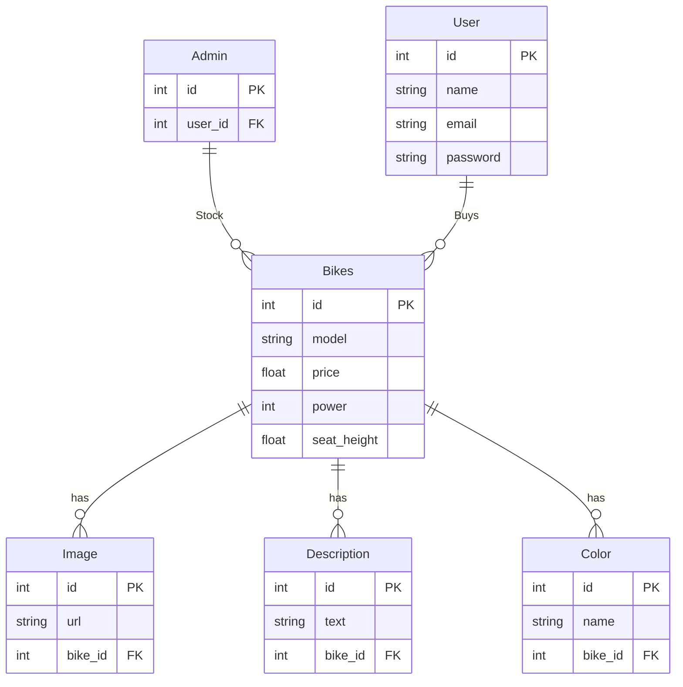

# Progetto-info

## Analisi

### Tabelle

1. User  
2. Admin  
3. Bikes  
4. Color  
5. Image  
6. Description  

### Relazioni presenti

In questo progetto ci sono 6 entità che hanno le seguenti relazioni:  
- **User** ha una relazione 1-N con **Bikes** perché un utente può acquistare più moto, ma una moto non può essere acquistata da più utenti.  
- **Bikes** ha relazioni 1-N con **Color**, **Image** e **Description** perché una moto può avere più colori, immagini e descrizioni, ma due moto non condivideranno mai le stesse immagini, descrizioni o colori.  

### ER



### Schema logico

- **User**(id, name, email, password)  
- **Admin**(id, user_id[FK])  
- **Bikes**(id, model, price, power, seat_height, user_id[FK])  
- **Color**(id, name, bike_id[FK])  
- **Image**(id, url, bike_id[FK])  
- **Description**(id, text, bike_id[FK])  

## SQL

### Codice SQL

```sql
-- Creazione della tabella User
CREATE TABLE User (
    id INT PRIMARY KEY,
    name VARCHAR(255) NOT NULL,
    email VARCHAR(255) NOT NULL UNIQUE,
    password VARCHAR(255) NOT NULL
);

-- Creazione della tabella Admin
CREATE TABLE Admin (
    id INT PRIMARY KEY,
    user_id INT NOT NULL,
    FOREIGN KEY (user_id) REFERENCES User(id)
);

-- Creazione della tabella Bikes
CREATE TABLE Bikes (
    id INT PRIMARY KEY,
    model VARCHAR(255) NOT NULL,
    price FLOAT NOT NULL,
    year INT NOT NULL,
    power FLOAT NOT NULL,
    seat_height FLOAT NOT NULL,
    user_id INT NOT NULL,
    FOREIGN KEY (user_id) REFERENCES User(id)
);

-- Creazione della tabella Color
CREATE TABLE Color (
    id INT PRIMARY KEY,
    name VARCHAR(255) NOT NULL,
    bike_id INT NOT NULL,
    FOREIGN KEY (bike_id) REFERENCES Bikes(id)
);

-- Creazione della tabella Image
CREATE TABLE Image (
    id INT PRIMARY KEY,
    url VARCHAR(255) NOT NULL,
    bike_id INT NOT NULL,
    FOREIGN KEY (bike_id) REFERENCES Bikes(id)
);

-- Creazione della tabella Description
CREATE TABLE Description (
    id INT PRIMARY KEY,
    text TEXT NOT NULL,
    bike_id INT NOT NULL,
    FOREIGN KEY (bike_id) REFERENCES Bikes(id)
);
```

### Integrazioni

```sql
-- Inserimento dati nella tabella User
INSERT INTO User (id, name, email, password) VALUES
(1, 'Mario Rossi', 'mario.rossi@example.com', 'password123'),
(2, 'Luigi Bianchi', 'luigi.bianchi@example.com', 'securepass456');

-- Inserimento dati nella tabella Admin
INSERT INTO Admin (id, user_id) VALUES
(1, 1);

-- Insert default admin user
INSERT OR IGNORE INTO users (id, email, password) VALUES
    (1, 'admin@motodealer.com', 'admin123');

INSERT OR IGNORE INTO admin (id, user_id) VALUES
    (1, 1);

-- Inserimento delle moto - Sport/Liter Bikes
INSERT INTO Bikes (id, model, price, year, power, seat_height, user_id) VALUES
    (1, 'S 1000 RR', 21450.00, 2025, 210, 832, 1),
    (2, 'R1', 20699.00, 2025, 200, 855, 2),
    (3, 'ZX-10R', 29990.00, 2025, 203, 835, 1),
    (4, 'Panigale V4', 27790.00, 2025, 215, 830, 2),
    (5, 'GSX-R1000', 17990.00, 2025, 199, 825, 1),
    (6, 'CBR1000RR-R', 31490.00, 2025, 217, 831, 2),
    (7, 'RSV4', 20999.00, 2025, 220, 840, 1),

-- Inserimento dei colori
-- S 1000 RR colors
INSERT INTO Color (id, name, swatch, image, bike_id) VALUES
    (1, 'Black Storm Metallic', '#000000', 'static/favicon/bikes/liter_bikes/s1k_color_2.webp', 1),
    (2, 'Light White/M Motorsport', '{"color1":"#ffffff","color2":"#003578"}', 'static/favicon/bikes/liter_bikes/s1k_color.webp', 1),
    (3, 'Metallic Gray/Black', '{"color1":"#808080","color2":"#000000"}', 'static/favicon/bikes/liter_bikes/s1k_color_3.webp', 1);


-- Inserimento delle immagini principali per ogni moto
-- Sport/Liter Bikes
INSERT INTO Image (id, url, bike_id) VALUES
    (1, 'static/favicon/bikes/liter_bikes/s1000rr_2.png', 1),
    (2, 'static/favicon/bikes/liter_bikes/s1000rr_3.png', 1),
    (3, 'static/favicon/bikes/liter_bikes/s1000rr_4.mp4', 1),
    (4, 'static/favicon/bikes/liter_bikes/r1_2.jpg', 2),
    (5, 'static/favicon/bikes/liter_bikes/r1_4.png', 2),
    (6, 'static/favicon/bikes/liter_bikes/r1_3.jpg', 2),
    (7, 'static/favicon/bikes/liter_bikes/zx10r_2.png', 3),
    (8, 'static/favicon/bikes/liter_bikes/zx10r_3.png', 3),
    (9, 'static/favicon/bikes/liter_bikes/v4.mp4', 4),
    (10, 'static/favicon/bikes/liter_bikes/v4_3.webp', 4),
    (11, 'static/favicon/bikes/liter_bikes/v4_4.jpg', 4),
    (12, 'static/favicon/bikes/liter_bikes/GSX-R1000.jpg', 5),
    (13, 'static/favicon/bikes/liter_bikes/GSX-R1000_3.png', 5),
    (14, 'static/favicon/bikes/liter_bikes/fire.webp', 6),
    (15, 'static/favicon/bikes/liter_bikes/cb_7.PNG', 6),
    (16, 'static/favicon/bikes/liter_bikes/cb_1.jpg', 6),
    (17, 'static/favicon/bikes/liter_bikes/cb_2.jpg', 6),
    (18, 'static/favicon/bikes/liter_bikes/cb_3.jpg', 6),
    (19, 'static/favicon/bikes/liter_bikes/cb_4.jpg', 6),
    (20, 'static/favicon/bikes/liter_bikes/cb_5.jpg', 6),
    (21, 'static/favicon/bikes/liter_bikes/cb_6.jpg', 6),
    (22, 'static/favicon/bikes/liter_bikes/rsv4_2.avif', 7),
    (23, 'static/favicon/bikes/liter_bikes/rsv4_3.avif', 7);

```

## Progettazione della pagina WEB

Python con Flask per il backend
SQLite per il database
HTML e Bootstrap per il frontend
Form submissions per le interazioni utente

### Struttura del progetto

```
Dealership/
├── app.py             
├── project-dealership.session.sql        
├── progress.md 
├── README.md         
├── static/           
│   ├── styles/
│   │        ├── login.css
│   │        ├── main.css
│   │        ├── account.css
│   │        ├── model.css
│   │        └── reg.css
│   ├── scripts/
│   │        ├── login.js
│   │        ├── main.js
│   │        ├── model.js
│   │        └── script.js
│   └── images/
│       ├── A2/
│       ├── display/
│       ├── liter_bikes/
│       ├── super_sport/
│       └── naked/
└── templates/       
  ├── account.html
  ├── log_page.html
  ├── main.html
  ├── model.html
  ├── reg_page.html
  └── request_quote.html
```

## Codice

# Progetto-info-3

## Setup Instructions

This project requires Python 3.x and should be run in a virtual environment to avoid dependency conflicts with system packages.

### Setting up the environment

1. First, make sure you have the necessary tools:
   ```bash
   sudo apt install python3-full python3-venv
   ```

2. Create a virtual environment in the project directory:
   ```bash
   python3 -m venv venv
   ```

3. Activate the virtual environment:
   - On Linux/Mac:
     ```bash
     source venv/bin/activate
     ```
   - On Windows:
     ```bash
     .\venv\Scripts\activate
     ```

4. Install the required packages:
   ```bash
   pip install -r requirements.txt
   ```

### Running the application

1. Make sure the virtual environment is activated (you should see `(venv)` in your terminal prompt)

2. Run the application:
   ```bash
   python server.py
   ```

3. Open a web browser and navigate to http://127.0.0.1:5000/

### Database Initialization

To initialize the database, navigate to http://127.0.0.1:5000/init-db after starting the server.

### Troubleshooting

- If you see an "externally-managed-environment" error, make sure you've activated the virtual environment.
- If the server fails to start, check that all dependencies are installed correctly.