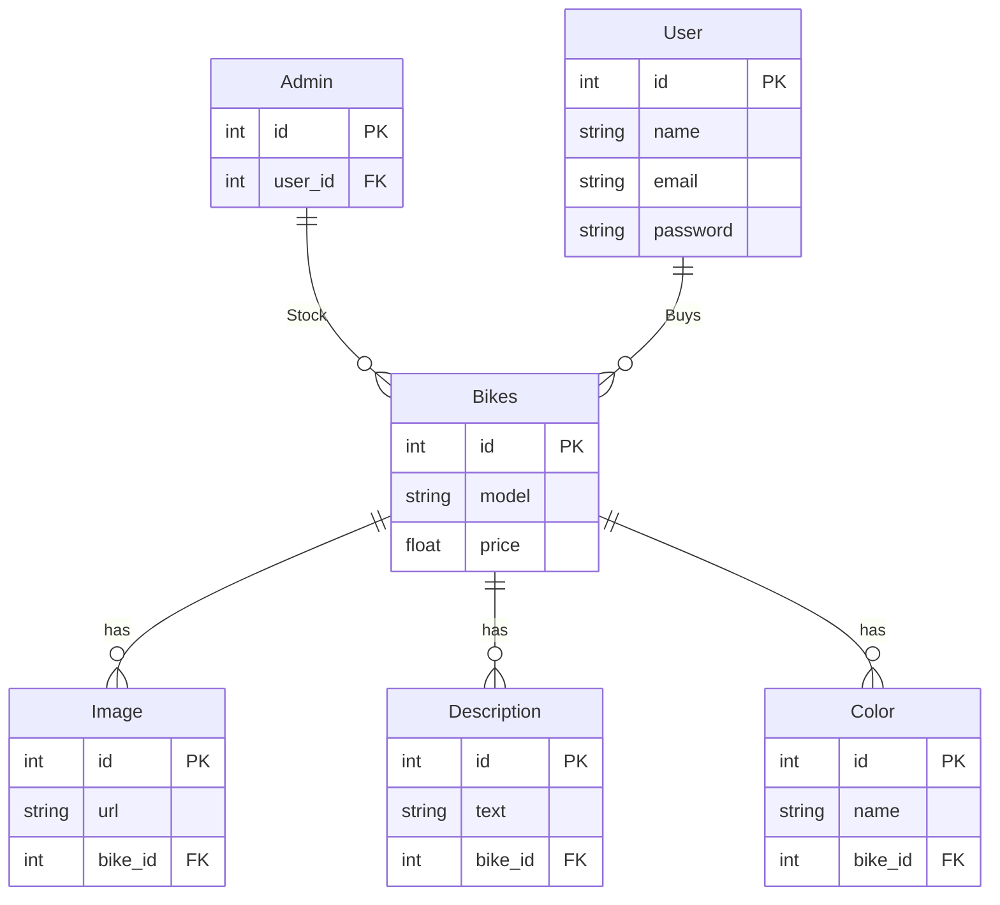

```mermaid
erDiagram
    User {
        int id PK
        string name
        string email
        string password
    }
    Admin {
        int id PK
        int user_id FK
    }
    Bikes {
        int id PK
        string model
        float price
    }
    Image {
        int id PK
        string url
        int bike_id FK
    }
    Description {
        int id PK
        string text
        int bike_id FK
    }
    Color {
        int id PK
        string name
        int bike_id FK
    }

    Admin ||--o{ Bikes: "Stock"
    Bikes ||--o{ Image : "has"
    Bikes ||--o{ Description : "has"
    Bikes ||--o{ Color : "has"
    User ||--o{ Bikes : "Buys"
```
